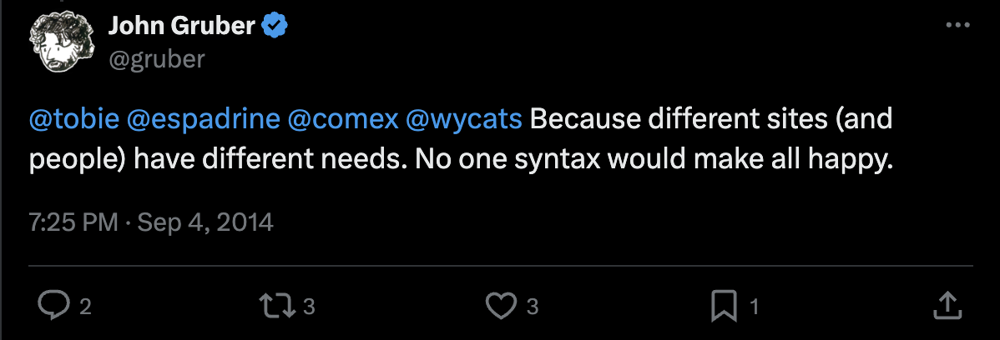
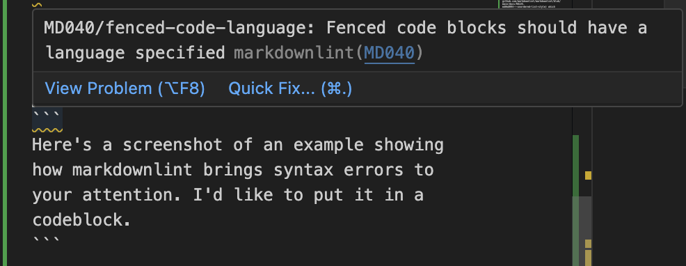
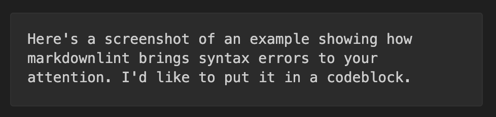

# Markdown best practices

Markdown is a popular markup language commonly used for collaborative documentation practices to create formatted text. With many implementations since its creation in 2004, Markdown has excellent readability and flexibility in its applications. 

## Table of contents

* [Style guides: Markdown's approach to best practices](#style-guides-markdowns-approach-to-best-practices)
* [When to choose a style guide](#when-to-choose-a-style-guide)
* [When to make a new style guide](#when-to-make-a-new-style-guide)
* [When to ignore the style guide](#when-to-ignore-the-style-guide)
* [Takeaways](#takeaways)

## Style guides: Markdown's approach to best practices

There is no single set of best practices for using Markdown. Though many communities have tried to standardize best practices through the creation of style guides, Markdown creater John Gruber has not created or endorsed a specific guide. His vision for Markdown is that it is flexible for many types of users.



## When to choose a style guide

Nevertheless, using a standardized Markdown makes it significantly easier to maintain uniformity within a company or project. To this point, Google has an [open source style guide](https://google.github.io/styleguide/docguide/style.html), and several websites have adopted a more standardized specification of Markdown called [CommonMark](https://commonmark.org/), including [Github](https://github.com/) and [Reddit](https://www.reddit.com/). There are also a variety of [linters](https://github.com/markdownlint/markdownlint/blob/main/docs/RULES.md#rules) which, much like spellcheck, will identify and fix Markdown errors for you so that you don't have to memorize hundreds of syntax rules.

The following situations support choosing a style guide appropriate for your situation:

 * Your product is documentation

 * Your company employs a large team with many contributors to documents

 * You are contributing to an open-source project

## When to make a new style guide

Sometimes, you or your company might choose to create a new Markdown style guide tailored to specific needs. Creating your own style guide allows you to standardize internal practices, ensure consistency across documentation, and allow collaboration with multiple authors without requiring you to adopt the rules of a style guide that otherwise does not meet your needs or is extraneous.

The following situations support creating a new style guide appropriate for your situation:

* Your documentation will stay internal

* You have a small team of writers that already documents their processes, effectively following their own style guide

* Your project may include specialized documentation, such as complicated equations or proprietary notation

## When to ignore the style guide

Of course, you don't always need to follow a style guide, especially if your project is personal, your team is small, or you're writing for non-technical audiences. Markdown was created to help make formatting plaintext easier, and was not created alongside a singular style guide. Much like any language, it serves many purposes and can be used informally or even artistically.

The following situations support throwing away the style guide and sculpting Markdown to your will:

* You're not worried about how the "raw" Markdown looks
* You're using Markdown for personal tasks such as note-taking or list-making
* You have an urgent update to make that cannot wait for strict adherence to formatting rules

## Takeaways

Of course, choosing or creating your own style guide doesn't mean you must follow it in every instance, and opting not to follow a style guide doesn't mean you've thrown it out the window for good. In many cases, a preexisting style guide or linter plugin will be easy to reference and help you create cohesive Markdown text.

If you're working in VSCode and looking for simple as-you-go help, I recommend the [markdownlint extension](https://marketplace.visualstudio.com/items?itemName=DavidAnson.vscode-markdownlint) alongside the use of this [markdownlint rules document](https://github.com/markdownlint/markdownlint/blob/main/docs/RULES.md#md004---unordered-list-style) which explains the errors markdownlint flags. 

For example, creating a code block in Markdown requires the use of three backticks (```) before and after the code. Markdownlint indicates an error if you do not provide a language after the primary backticks:



However, the codeblock publishes normally despite the error:



This is a good example of a situation when you face a choice to follow or ignore the style guide. If you are publishing on a personal blog and are the only person to see your raw markdown, and you don't mind the zigzag error line, then nobody else will be able to tell that you haven't followed best practices. However, if you are not the only collaborator on the Markdown file, or if your work is used as an example for new learners, it might be a good idea to take the extra time to fix the error.
